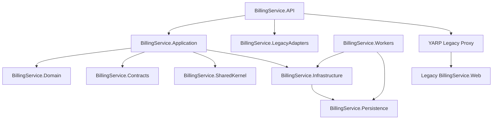
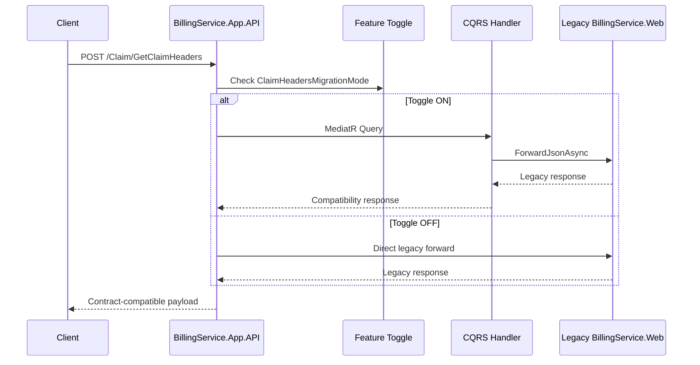
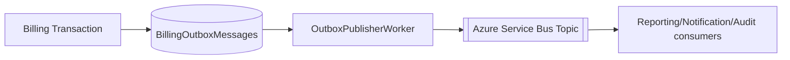

# Architecture Diagrams

## Target clean architecture

```mermaid
graph TD
    API[BillingService.API] --> APP[BillingService.Application]
    API --> LEGACY[BillingService.LegacyAdapters]
    APP --> DOMAIN[BillingService.Domain]
    APP --> CONTRACTS[BillingService.Contracts]
    APP --> SHARED[BillingService.SharedKernel]
    APP --> INFRA[BillingService.Infrastructure]
    INFRA --> PERSIST[BillingService.Persistence]
    WORKER[BillingService.Workers] --> INFRA
    WORKER --> PERSIST
    API --> YARP[YARP Legacy Proxy]
    YARP --> LEGACYHOST[Legacy BillingService.Web]
```

## Request path during migration

```mermaid
sequenceDiagram
    participant C as Client
    participant A as BillingService.App.API
    participant F as Feature Toggle
    participant Q as CQRS Handler
    participant L as Legacy BillingService.Web
    C->>A: POST /Claim/GetClaimHeaders
    A->>F: Check ClaimHeadersMigrationMode
    alt Toggle ON
      A->>Q: MediatR Query
      Q->>L: ForwardJsonAsync
      L-->>Q: Legacy response
      Q-->>A: Compatibility response
    else Toggle OFF
      A->>L: Direct legacy forward
      L-->>A: Legacy response
    end
    A-->>C: Contract-compatible payload
```

## Outbox event flow

```mermaid
flowchart LR
    Txn[Billing Transaction] --> Outbox[(BillingOutboxMessages)]
    Outbox --> Worker[OutboxPublisherWorker]
    Worker --> SB[[Azure Service Bus Topic]]
    SB --> Downstream[Reporting/Notification/Audit consumers]
```

