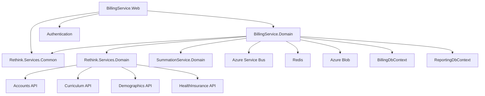
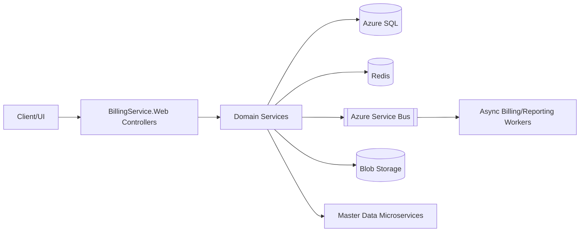

# Phase 1 - Current System Analysis (Non-Breaking Baseline)

## Scope analyzed

- `Microservices/BillingService/BillingService.Web`
- `Microservices/BillingService/BillingService.Domain`
- `Microservices/BillingService/ClientService.Web`
- Shared dependencies:
  - `Microservices/Rethink.Services.Common`
  - `Microservices/Rethink.Services.Domain`
  - `Microservices/SummationService.Domain`
  - `Microservices/Authentication`

## Existing business workflows (as implemented today)

1. **Claims lifecycle**
   - Create, validate, update, sync, submit, approval, and status updates.
   - Controllers: `ClaimController`, `ClaimUpdateController`, `NotifyClaimStatusController`.
   - Domain services: `ClaimService`, `ClaimCreateService`, `ClaimValidationService`, `ClaimSyncService`.
2. **Claim posting and payment posting**
   - Payment creation, claim payment, service-line adjustments, bulk posting.
   - Controllers: `ClaimPostingController`, `PaymentPostingController`, `ServiceLineAdjustmentController`, `BulkPaymentPostingController`.
3. **Attachments and notes**
   - Claim/payment attachments, claim/payment notes.
   - Controllers: `ClaimAttachmentController`, `PaymentAttachmentController`, `ClaimNoteController`, `PaymentNoteController`.
4. **Patient invoices and reporting**
   - Invoice generation, collection, PDF operations, reporting queries.
   - Controller: `PatientInvoiceController`.
   - Services: `PatientInvoiceService`, `PdfService`, reporting `DbContext`.
5. **Clearinghouse + EDI**
   - EDI generation/processing, clearinghouse submission, ERA processing.
   - Controller: `ClearingHouseController`, `EdiFileController`.
6. **Billing settings and funder settings**
   - Billing defaults/configuration and funder configuration.
   - Controllers: `BillingSettingsController`, `FunderSettingController`.
7. **Appointments and charge history**
   - Unprocessed/unbilled appointments and client charge history.
   - Controllers: `AppointmentController`, `AppointmentReportsController`, `ClientChargeHistoryController`.

## API contract inventory (high-level)

- Route style is primarily `[Route("[controller]/[action]")]`.
- Auth is dual mode:
  - `XApiKey` header -> API key middleware.
  - No API key -> JWT middleware (+ billing master data middleware).
- Swagger exposes both `Bearer` and `XApiKey`.
- Frontend and external consumers depend on current route patterns and payload structures in controller actions.

## DB dependency map

Primary data dependencies:

- `BillingDbContext` (core transactional billing data)
- `ReportingDbContext` (reporting entities and aggregations)
- Stored procedure dependencies in claim search/listing paths:
  - `GetClaimsByAccountInfoId`
  - `GetClaimsCount`
  - `GetClaimsPatientsFilters`
  - `GetClaimsFundersFilters`
  - `GetClaimsRPFilters`

Compatibility risk: these procedure contracts are de-facto API contracts for service behavior.

## Integration dependency map

- **Redis**: session/master data caching and general caching services.
- **Azure Service Bus**: claim/payment async workflows through queue/topic names.
- **Azure Blob Storage**: EDI files and attachment artifacts.
- **External microservices (HTTP)**:
  - Accounts, Curriculum, Demographics, HealthPlans, HealthInsurance, MedicalRecords, PracticeOperations, Appointment.
- **Application Insights** and health checks.
- **Pusher** notification integration.

## Authentication/authorization flow

- Middleware pipeline uses both authentication schemes and conditionally applies middleware based on `XApiKey`.
- JWT claims (`BillingSessionKey`, `AccountInfoId`) are used to build request context for cache keying/session behavior.

## Frontend dependency surface

Frontend integration relies on:

- Route conventions (`/Controller/Action`)
- Existing response payload shapes
- Existing error semantics
- Existing auth headers and token claims

## Observed bottlenecks and operational risks

1. **Sync-over-async in startup and service paths**
   - `.Result`, `.Wait()`, `.GetAwaiter().GetResult()`.
2. **Potential N+1 and per-item remote calls**
   - Multi-call orchestration in claim/payment services.
3. **Ad-hoc `HttpClient` usage**
   - Missed connection pooling opportunities.
4. **Ambiguous route risk**
   - Duplicate `HttpGet("{accountId:int}")` in `BillingSettingsController`.
5. **Large payload usage**
   - Very large `take` values in upstream calls.
6. **Cache registration ambiguity**
   - Multiple `ICacheManager` registrations with last-write-wins behavior.

## Dependency graph

## Business workflow map (compatibility critical paths)

## Risk assessment for non-breaking modernization

| Risk | Impact | Mitigation |
|---|---|---|
| API contract drift | Frontend/integration breakage | Keep route + payload contracts; use compatibility proxy for non-migrated endpoints |
| Stored procedure behavior change | billing data/report mismatches | preserve existing SP calls; optimize with index additions first |
| Auth flow drift | request rejection/session mismatch | preserve dual auth pipeline and claims contract |
| Async migration regression | duplicate or missing side effects | outbox + idempotency keys + DLQ |
| Cache staleness | stale billing dashboard metrics | explicit invalidation + TTL + event-triggered bust |
| Performance tuning regressions | hidden behavioral drift | snapshot + contract + regression tests before toggling |

## Regression protection strategy (must exist before refactor)

1. **Contract baselines**
   - Capture request/response snapshots for top APIs.
2. **DB result parity**
   - Validate key reporting and claim listing outputs pre/post migration.
3. **Feature-toggle rollout**
   - Endpoint-level toggle for migrated handlers.
4. **Proxy fallback**
   - Immediate reroute to legacy if mismatch detected.
5. **Shadow traffic (non-mutating endpoints)**
   - Compare responses in logs before enabling migrated path.
6. **Golden metrics guardrails**
   - P95 latency, error rate, cache hit ratio, queue depth, dead-letter count.

