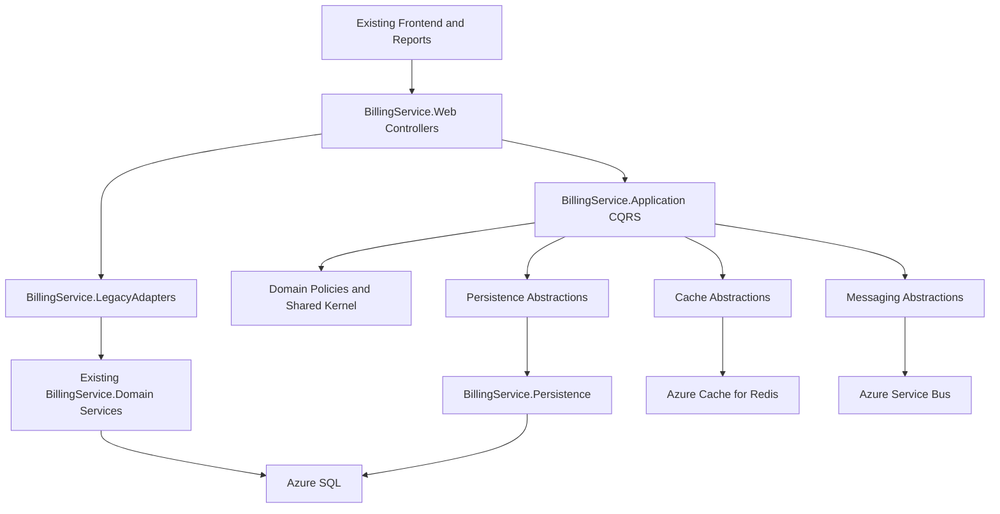
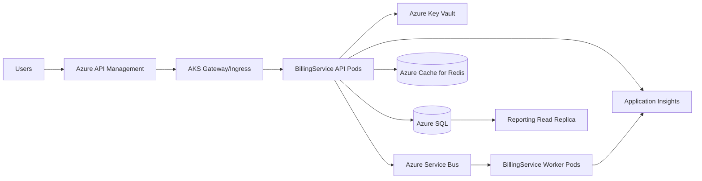
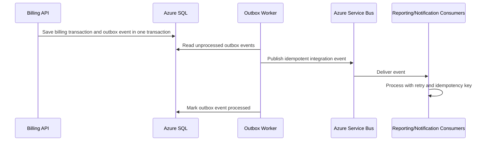

# BillingService Architecture Diagrams

## Incremental Clean Architecture

```mermaid
flowchart TD
    Frontend[Existing Frontend and Reports] --> API[BillingService.Web Controllers]
    API --> LegacyAdapters[BillingService.LegacyAdapters]
    LegacyAdapters --> ExistingDomain[Existing BillingService.Domain Services]
    API --> Application[BillingService.Application CQRS]
    Application --> Domain[Domain Policies and Shared Kernel]
    Application --> PersistenceContracts[Persistence Abstractions]
    PersistenceContracts --> Persistence[BillingService.Persistence]
    Application --> CacheContracts[Cache Abstractions]
    CacheContracts --> Redis[Azure Cache for Redis]
    Application --> MessagingContracts[Messaging Abstractions]
    MessagingContracts --> ServiceBus[Azure Service Bus]
    Persistence --> AzureSql[Azure SQL]
    ExistingDomain --> AzureSql
```

## AKS Production Topology

```mermaid
flowchart LR
    User[Users] --> APIM[Azure API Management]
    APIM --> Ingress[AKS Gateway/Ingress]
    Ingress --> Pods[BillingService API Pods]
    Pods --> KeyVault[Azure Key Vault]
    Pods --> SQL[(Azure SQL)]
    Pods --> Redis[(Azure Cache for Redis)]
    Pods --> Bus[Azure Service Bus]
    Bus --> Workers[BillingService Worker Pods]
    Pods --> AppInsights[Application Insights]
    Workers --> AppInsights
    SQL --> Reports[Reporting Read Replica]
```

## Event-Driven Outbox Flow

```mermaid
sequenceDiagram
    participant API as Billing API
    participant DB as Azure SQL
    participant Outbox as Outbox Worker
    participant Bus as Azure Service Bus
    participant Consumer as Reporting/Notification Consumers

    API->>DB: Save billing transaction and outbox event in one transaction
    Outbox->>DB: Read unprocessed outbox events
    Outbox->>Bus: Publish idempotent integration event
    Bus->>Consumer: Deliver event
    Consumer->>Consumer: Process with retry and idempotency key
    Outbox->>DB: Mark outbox event processed
```
