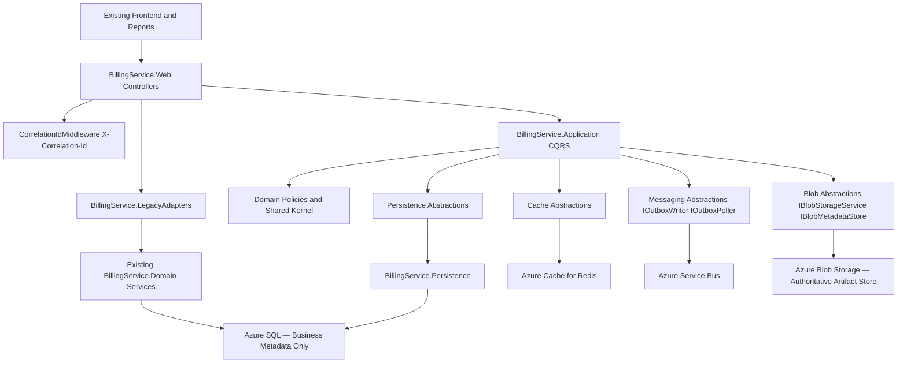
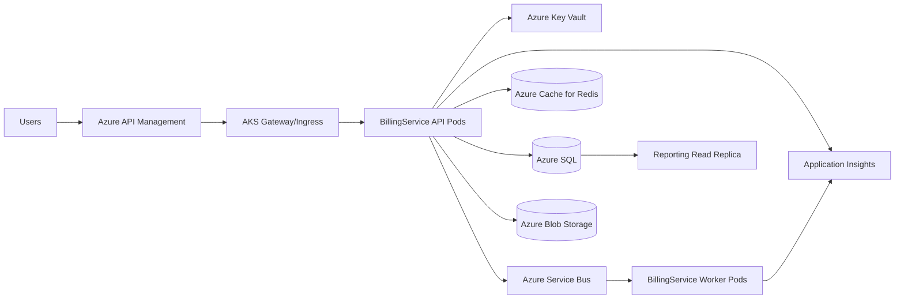
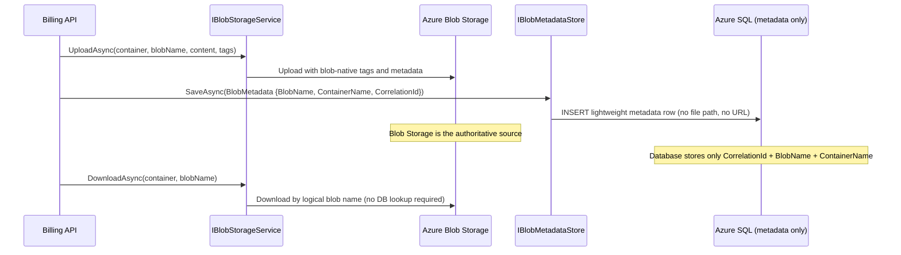
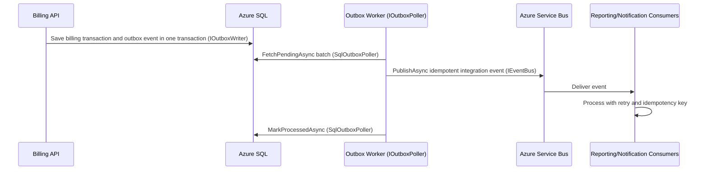
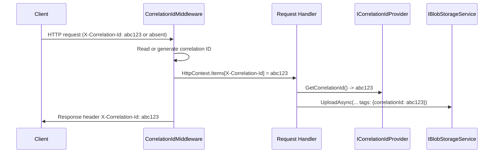

# BillingService Architecture Diagrams

## Incremental Clean Architecture

```mermaid
flowchart TD
    Frontend[Existing Frontend and Reports] --> API[BillingService.Web Controllers]
    API --> CorrelationId[CorrelationIdMiddleware X-Correlation-Id]
    API --> LegacyAdapters[BillingService.LegacyAdapters]
    LegacyAdapters --> ExistingDomain[Existing BillingService.Domain Services]
    API --> Application[BillingService.Application CQRS]
    Application --> Domain[Domain Policies and Shared Kernel]
    Application --> PersistenceContracts[Persistence Abstractions]
    PersistenceContracts --> Persistence[BillingService.Persistence]
    Application --> CacheContracts[Cache Abstractions]
    CacheContracts --> Redis[Azure Cache for Redis]
    Application --> MessagingContracts[Messaging Abstractions IOutboxWriter IOutboxPoller]
    MessagingContracts --> ServiceBus[Azure Service Bus]
    Application --> BlobContracts[Blob Abstractions IBlobStorageService IBlobMetadataStore]
    BlobContracts --> BlobStorage[Azure Blob Storage — Authoritative Artifact Store]
    Persistence --> AzureSql[Azure SQL — Business Metadata Only]
    ExistingDomain --> AzureSql
```

## AKS Production Topology

```mermaid
flowchart LR
    User[Users] --> APIM[Azure API Management]
    APIM --> Ingress[AKS Gateway/Ingress]
    Ingress --> Pods[BillingService API Pods]
    Pods --> KeyVault[Azure Key Vault]
    Pods --> SQL[(Azure SQL)]
    Pods --> Redis[(Azure Cache for Redis)]
    Pods --> Bus[Azure Service Bus]
    Pods --> Blob[(Azure Blob Storage)]
    Bus --> Workers[BillingService Worker Pods]
    Pods --> AppInsights[Application Insights]
    Workers --> AppInsights
    SQL --> Reports[Reporting Read Replica]
```

## Blob-First Storage Flow

```mermaid
sequenceDiagram
    participant API as Billing API
    participant BlobSvc as IBlobStorageService
    participant Blob as Azure Blob Storage
    participant MetaStore as IBlobMetadataStore
    participant SQL as Azure SQL (metadata only)

    API->>BlobSvc: UploadAsync(container, blobName, content, tags)
    BlobSvc->>Blob: Upload with blob-native tags and metadata
    API->>MetaStore: SaveAsync(BlobMetadata {BlobName, ContainerName, CorrelationId})
    MetaStore->>SQL: INSERT lightweight metadata row (no file path, no URL)
    Note over Blob: Blob Storage is the authoritative source
    Note over SQL: Database stores only CorrelationId + BlobName + ContainerName

    API->>BlobSvc: DownloadAsync(container, blobName)
    BlobSvc->>Blob: Download by logical blob name (no DB lookup required)
```

## Event-Driven Outbox Flow

```mermaid
sequenceDiagram
    participant API as Billing API
    participant DB as Azure SQL
    participant Outbox as Outbox Worker (IOutboxPoller)
    participant Bus as Azure Service Bus
    participant Consumer as Reporting/Notification Consumers

    API->>DB: Save billing transaction and outbox event in one transaction (IOutboxWriter)
    Outbox->>DB: FetchPendingAsync batch (SqlOutboxPoller)
    Outbox->>Bus: PublishAsync idempotent integration event (IEventBus)
    Bus->>Consumer: Deliver event
    Consumer->>Consumer: Process with retry and idempotency key
    Outbox->>DB: MarkProcessedAsync (SqlOutboxPoller)
```

## Correlation ID Propagation

```mermaid
sequenceDiagram
    participant Client
    participant Middleware as CorrelationIdMiddleware
    participant Handler as Request Handler
    participant Provider as ICorrelationIdProvider
    participant BlobSvc as IBlobStorageService

    Client->>Middleware: HTTP request (X-Correlation-Id: abc123 or absent)
    Middleware->>Middleware: Read or generate correlation ID
    Middleware->>Handler: HttpContext.Items[X-Correlation-Id] = abc123
    Handler->>Provider: GetCorrelationId() -> abc123
    Handler->>BlobSvc: UploadAsync(... tags: {correlationId: abc123})
    Middleware->>Client: Response header X-Correlation-Id: abc123
```
